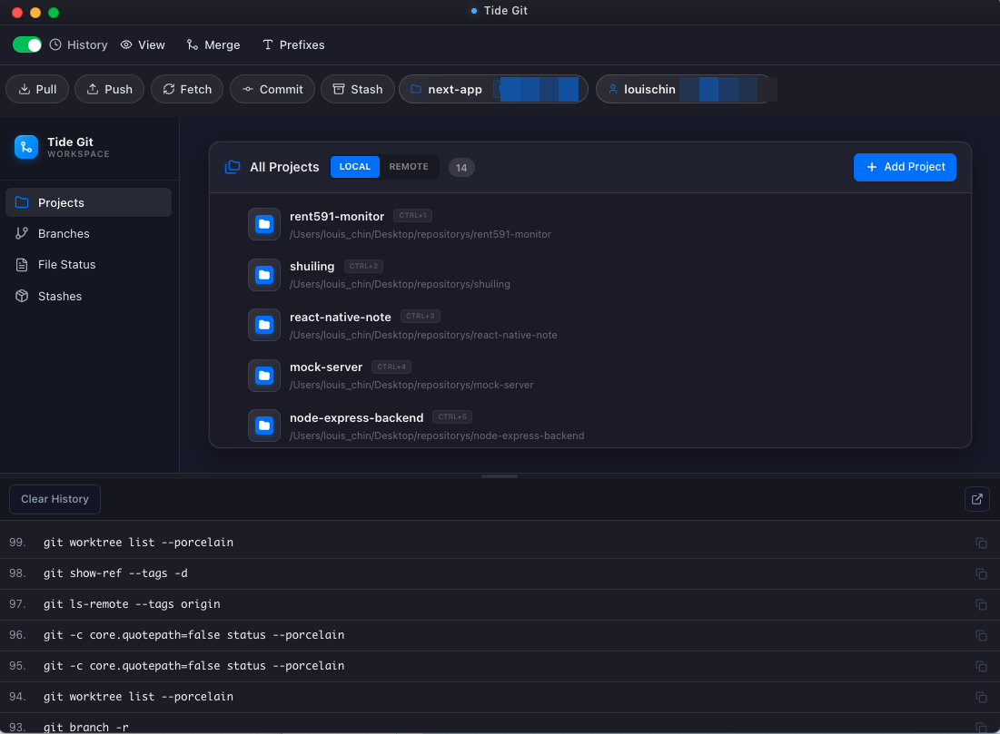
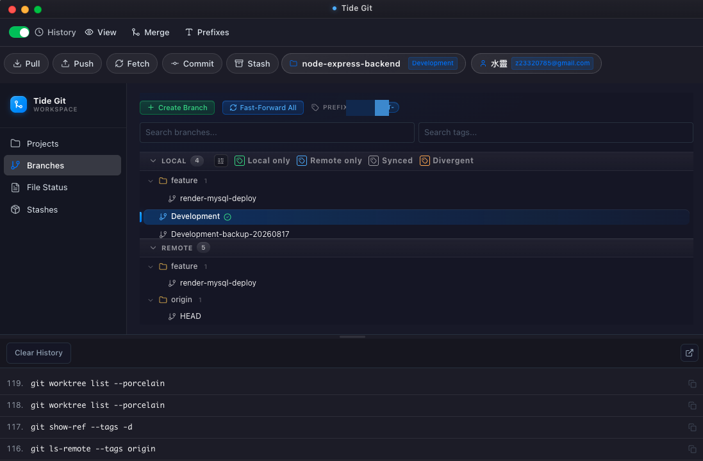
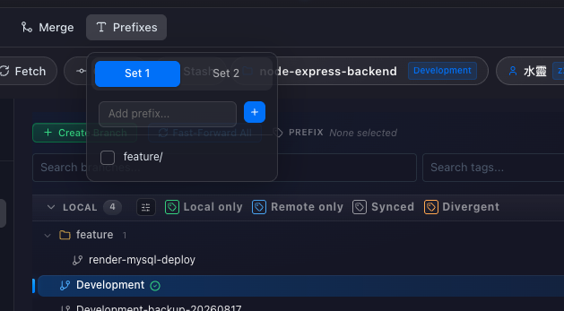
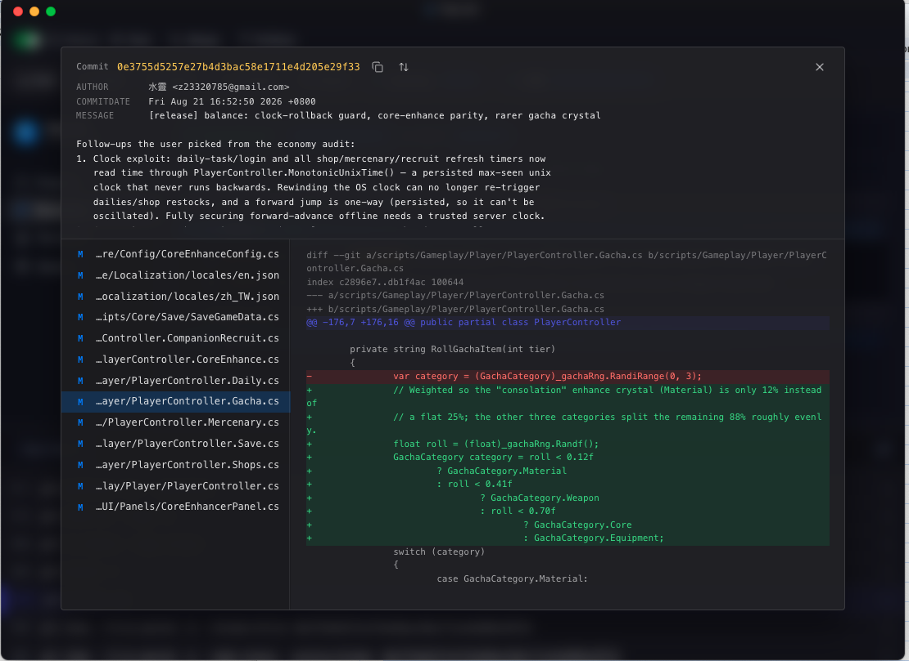

<div align="center">


# 🌊 Tide Git

**A fast, keyboard-driven Git GUI for juggling many repositories at once.**

Built with Electron · React · Redux Toolkit · Ant Design


</div>

---

## 📸 Screenshots

<div align="center">



<br/><br/>



<br/><br/>



<br/><br/>



</div>

---

## ✨ Features

- 🗂️ **Multi-project workspace** — register many repos and jump between them instantly with quick-switch shortcuts (Ctrl + 1…N).
- 🌿 **Branch management** — local & remote branches, create / fast-forward, and Local-only / Remote-only / Synced / Divergent status at a glance.
- 🌱 **Prefix-based branch creation** — save reusable prefix sets (e.g. `feature/`) and spin up consistently-named branches in one click.
- 🔍 **Commit & diff viewer** — browse commit history and read changes line-by-line.
- 📋 **File status** — inspect and stage your working tree.
- 📦 **Stashes** — create and restore stashes without touching the terminal.
- 🏷️ **Tags** — list and manage tags.
- ⬇️ ⬆️ **Pull · Push · Fetch · Merge** — right from the toolbar.
- 🧾 **Live command history** — see the exact `git` commands the UI runs (great for learning and debugging).

---

## 🚀 Getting Started

**Prerequisites:** Node.js 16+, Git, and npm or yarn.

```bash
# install
yarn            # or: npm install

# run in development
yarn dev        # or: npm run dev

# build for production
yarn build:win      # Windows
yarn build:mac      # macOS
yarn build:linux    # Linux
```

---

<details>
<summary><b>🏗️ Project structure</b></summary>

```
src/renderer/src/
├── modules/                 # Feature modules
│   └── git/                 # Git module (components, layout, Redux store)
├── shared/                  # Reusable components, hooks, utils
└── main.jsx                 # Renderer entry point
```

**Recommended IDE:** VS Code + ESLint + Prettier.

</details>

<div align="center">
<sub>Built with ❤️ using Electron + React</sub>
</div>
